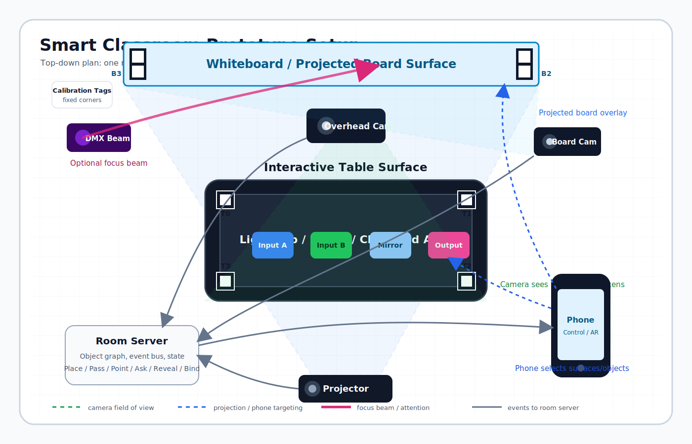

# Room Setup Diagram

Top-down setup for the first physical version:

## Pieces

- Projector: second-screen browser output, later calibrated to table/board.
- Overhead camera: sees table calibration tags and movable object cards.
- Board camera: sees whiteboard tags, sticky notes, board drawings, and pointing.
- Interactive table: primary place/pass surface for Light Lab markers and object cards.
- Whiteboard/projected board: semantic notes, focus, slide binding, and explanations.
- Phone companion: local controller and AR target selector.
- DMX light: optional focus beam after projected focus is stable.
- Room server: object graph, event bus, state, replay, and room character context.

## First Physical Layout

1. Put the projector on a second display or physical projector.
2. Place four fixed table calibration tags at table corners.
3. Place four fixed board calibration tags at whiteboard corners.
4. Put the overhead camera high enough to see the whole table.
5. Put the board camera off-axis enough to see the whole board.
6. Start with projected focus before using the DMX beam.
7. Use phone manual target selection first; add QR/AprilTag camera target once HTTPS or local camera access is sorted.
