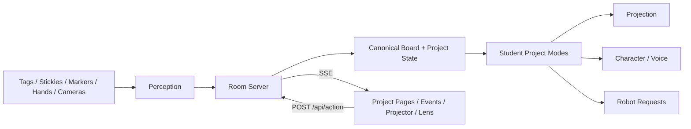

# Student Project Bridges

This is the canonical bridge map between the room system and the real submitted student projects from `smart-objects-cameras`.

## System Contract

### SSE

The room server broadcasts:

- `state`
- `room-event`

Project pages subscribe directly to SSE and update their local view.

### POST actions

Project pages and test tools send:

- `project heartbeat`
- `project event`
- `project.set`
- `project.reset`
- `event.manual`

Compatibility endpoints for student scripts:

- `POST /api/projects/:id/heartbeat`
- `POST /api/projects/:id/events`
- `GET /subscribe/events?subscriber_id=:id`
- `GET /api/projects/:id/contract.md`
- `GET /api/projects/readiness`

### CSE

Client-side event handling stays page-local:

- direct `Room.onState(...)`
- direct `Room.onEvent(...)`
- no extra client event bus

## Ownership

- core room server owns transport, shared state, and board/runtime contracts
- project packets own interpretation, prompts, overlays, and mock test state
- student projects should integrate by emitting and subscribing to room events, not by coupling to each other directly

## Project Map

| Project | Primary Modes | Reads | Writes | Explicit | Implicit | Best Combos |
|---|---|---|---|---|---|---|
| Smart Stage | `stage`, `focus` | board zones, tags, presence | scene state, captions, timer offers | drop stage tag, pick scene | stage readiness from room state | Focus Beam, Gus, Timer |
| Focus Beam | `focus`, `stage` | pointer, gestures, zones | beam target, focus ring | point at board, enable beam | dwell-based focus | Smart Stage, Lumi |
| Forest in the Classroom | `explore`, `character` | presence, voice, scenes | ambient projection, mood | pick habitat / forest scene | room energy changes mood | Smart Stage, Gus |
| Imprint | `write` | board text, strokes, fiducials | notes, annotations | capture a board region | dense writing cluster becomes note | Lumi, Focus Beam |
| NodCheck | `check-understanding` | head pose, prompts, attention | nod summaries | start a check window | nod rate and gaze drift | Timer, Tony |
| Tony the Bot | `character`, `check-understanding` | presence, emotion, attention | help prompts, health state | ask Tony for help | confusion cluster triggers help | NodCheck, Lumi |
| Tony Emotion Layer | `character`, `check-understanding` | emotion, presence | alerts, emotion summaries | arm emotion watch | expression shifts raise alerts | Tony, A Room |
| English Communication Coach (Lumi) | `write`, `character` | board text, speech | grammar suggestions, summaries | underline text, ask for rewrite | repeated grammar patterns | Imprint, Focus Beam |
| Timer | `safety-control`, `check-understanding` | gestures, timer offers | timer lifecycle | gesture to start/pause | pacing inferred from idle room | NodCheck, Smart Stage |
| Gus Mode / Virtual Gus | `character`, `stage` | presence, attention, room mode | projected character state | summon Gus, switch state | room energy alters Gus | Smart Stage, Forest |
| A Room | `character`, `safety-control` | occupancy, activity, attention | ambience changes, mode recommendations | apply ambience preset | room quietly adapts | Smart Stage, Forest, Tony |

## Affordances

### Explicit affordances

- tags dropped into board zones
- writing or circling a region
- pinning a sticky note
- pointing at a board region
- using gestures to start, pause, clear, or reveal
- summoning a helper character

### Implicit affordances

- attention direction
- nodding and stillness
- hesitation before writing or speaking
- board clutter density
- repeated marks in one region
- occupancy and room energy

## Dependency Shape



## Student Integration Rule

If a student project can answer these clearly, it fits:

1. what does it subscribe to?
2. what does it emit?
3. what board or room state does it read?
4. what visible output does it create?
5. what is explicit vs implicit in its interaction model?

If those answers are unclear, the project is not yet integrated cleanly enough.

Each live project should also have a generated contract prompt at:

```text
/api/projects/{project_id}/contract.md
```
